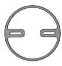
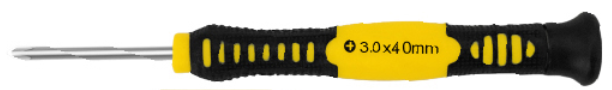

# 1. Product introduction

## 1.1 Overview

DIY is the activity of making or repairing things yourself, especially in your home. Historically, it has been popular all over the world since 1960s, making our routine life interesting.Combined with STEM education, DIY products can greatly cultivate teenagers’ imagination and creativity.

Therefore, we Keyestudio R&D group rolls out an amazing 4DOF mechanical arm kit, which contributes to improving kids’hand-on ability, logical thinking and observation ability.

It is easy to build to say the least. In fact, the four servos of this robot arm are controlled by V4.0 control board and two joystick modules. What’s more, the detailed tutorials are provided for you even you are a starter.

For this mechanical robot arm, there are three methods to control. The first one is controller handle we provide(joystick modules), the second one is App; and the third one is wireless PS2 joystick module(not included in this kit).

I believe that you can’t help getting down with this kit.

Next, let’s get started.

## 1.2 Features

You can check out these features:

-   Detailed installation instructions

-   Detailed debugging methods, starting Arduino from entry.

-   Three controlling methods: Wired JoyStick Control; Phone Bluetooth Control;
    Wireless PS2 JoyStick Control.

**The parameters of keyestudio servo motor/ drive shield are as follows:**

-   VIN voltage: VIN = DC 7-15V

-   VIN current: 5A

-   Two-channl 5V output: 5V/3A

-   PS2 interface: compatible with Sony PS2 receiver, can be plugged directly
    into the expansion board.

-   Dimensions: 73*53.34mm

## 1.3 Kit List

You can see a pretty beautiful packaging box for the arm kit, and inside the packaging you will find all the parts and screws listed below.

Note: Peel the plastic film off the board first when you install robotic arm.

| No.  | Item                                  | QTY  | Picture                                                      |
| ---- | ------------------------------------- | ---- | ------------------------------------------------------------ |
| 1    | Keyestudio V4.0Control Board          | 1    |                      |
| 2    | Keyestudio Servo Motor Driver Shield  | 1    |                      |
| 3    | Acrylic Boards                        | 1    |                      |
| 4    | Acrylic Handle                        | 1    |                      |
| 5    | MeArm ABS Cylindrical Holder          | 1    |                      |
| 6    | 180° Black Servo                      | 4    |                      |
| 7    | BT-24 Module                          | 1    |                      |
| 8    | Keyestudio Joystick Module            | 2    |                      |
| 9    | 3D PS2 Joystick Cap                   | 2    |  |
| 10   | 3*40MM Screwdriver                    | 1    |                      |
| 11   | Galvanized Wrench                     | 1    |                      |
| 12   | M3*6MM Round Head Screws              | 12   |                      |
| 13   | M3*10MM Round Head Screws             | 22   |                      |
| 14   | M3*12MM Round Head Screws             | 12   |                      |
| 15   | M3*24+6MM Copper Pillar               | 4    |                      |
| 16   | M3*6mm+6mm Copper Pillar              | 10   |                      |
| 17   | M3 Stainless Steel Hex Nuts           | 22   |                      |
| 18   | M3 Hexagon Nuts                       | 24   |                      |
| 19   | M1.2x5MM Phillips Self-tapping Screws | 8    |                      |
| 20   | M2x5MM Phillips Self-tapping Screws   | 10   |                      |
| 21   | M3 304 Stainless Steel Flat Washer    | 10   |                      |
| 22   | M2x8MM Phillips Self-tapping Screws   | 2    |                      |
| 23   | M3*16MM Flat Head Screws              | 4    |                      |
| 24   | Male-Female 10CM Jumper Wire          | 4    |                      |
| 25   | Female- Female 50CM Jumper Wire       | 10   |                      |
| 26   | Black 3*100MM Cable Ties              | 7    |                      |
| 27   | 18650 2-Slot Battery Holder           | 1    |                      |

## 1.4 Keyestudio V4.0 Development Board

Keyestudio V4.0 development board is an Arduino uno-compatible board, which is based on ATmega328P MCU, and with a cp2102 Chip as a UART-to-USB converter.

| 1    | **ICSP (In-Circuit Serial Programming) Header** | the AVR, an Arduino micro-program header consisting of MOSI, MISO, SCK, RESET, VCC, and GND. It is often called the SPI (serial peripheral interface) and can be considered an "extension" of the output. In fact, slave the output devices to the SPI bus host. When connecting to PC, program the firmware to ATMEGA328P-PU. |
| ---- | ----------------------------------------------- | ------------------------------------------------------------ |
| 2    | **Power LED Indicator**                         | Powering the Arduino, LED on means that your circuit board is correctly powered on. If LED is off, connection is wrong. |
| 3    | **Digital I/O**                                 | Arduino MEGA has 14 digital input/output pins (of which 6 can be used as PWM outputs).These pins can be configured as digital input pin to read the logic value (0 or 1). Or used as digital output pin to drive different modules like LED, relay, etc. Using [pinMode()](https://www.arduino.cc/reference/en/language/functions/digital-io/pinmode/), [digitalWrite()](https://www.arduino.cc/reference/en/language/functions/digital-io/digitalwrite/), and [digitalRead()](https://www.arduino.cc/reference/en/language/functions/digital-io/digitalread/) functions. |
| 4    | **GND**                                         | GND                                                          |
| 5    | **AREF**                                        | Reference voltage (0-5V) for analog inputs. Used with [analogReference()](https://www.arduino.cc/reference/en/language/functions/analog-io/analogreference/). Configures the reference voltage used for analog input (i.e. the value used as the top of the input range). |
| 6    | **SDA**                                         | IIC communication pin                                        |
| 7    | **SCL**                                         | IIC communication pin                                        |
| 8    | **RESET Button**                                | You can reset your Arduino board.                            |
| 9    | **D13 LED**                                     | There is a built-in LED driven by digital pin 13. When the pin is HIGH value, the LED is on, when the pin is LOW, it's off. |
| 10   | **USB Connection**                              | Arduino board can be powered via USB connector. All you needed to do is connecting the USB port to PC using a USB cable. |
| 11   | **CP2102**                                      | USB serial chip, translate the USB signal of computer into serial signal |
| 12   | **TX LED**                                      | Onboard you can find the label: TX (transmit) When Arduino board communicates via serial port, send the message, TX led flashes. |
| 13   | **RX LED**                                      | Onboard you can find the label: RX(receive ) When Arduino board communicates via serial port, receive the message, RX led flashes. |
| 14   | **Crystal Oscillator**                          | How does Arduino calculate time? by using a crystal oscillator. The number printed on the top of the Arduino crystal is 16.000H9H. It tells us that the frequency is 16,000,000 Hertz or 16MHz. |
| 15   | **Voltage Regulator**                           | To control the voltage provided to the Arduino board, as well as to stabilize the DC voltage used by the processor and other components. Convert an external input DC7-12V voltage into DC 5V, then switch DC 5V to the processor and other components. |
| 16   | **DC Power Jack**                               | Arduino board can be supplied with an external power DC7-12V from the DC power jack. |
| 17   | **Microcontroller**                             | Each Arduino board has its own microcontroller. You can regard it as the brain of your board. The main IC (integrated circuit) on the Arduino is slightly different from the panel pair. Microcontrollers are usually from ATMEL. Before you load a new program on the Arduino IDE, you must know what IC is on your board. This information can be checked at the top of IC. |
| 18   | **IOREF**                                       | This pin on the board provides the voltage reference with which the microcontroller operates. A properly configured shield can read the IOREF pin voltage and select the appropriate power source or enable voltage translators on the outputs for working with the 5V or 3.3V. |
| 19   | **RESET Header**                                | Connect an external button to reset the board. The function is the same as reset button. |
| 20   | **Power Pin 3V3**                               | A 3.3 volt supply generated by the on-board regulator. Maximum current draw is 50 mA. |
| 21   | **Power Pin 5V**                                | Provides 5V output voltage                                   |
| 22   | **Vin**                                         | You can supply an external power input DC7-12V through this pin to Arduino board. |
| 23   | **Analog Pins**                                 | Onboard has 6 analog inputs, labeled A0 to A5.               |

