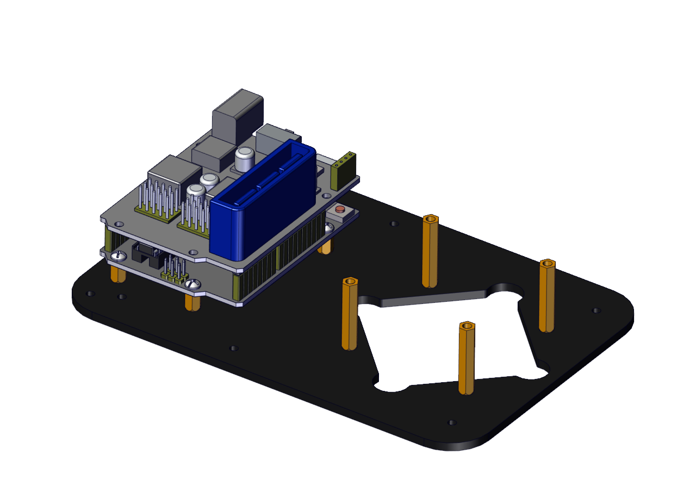
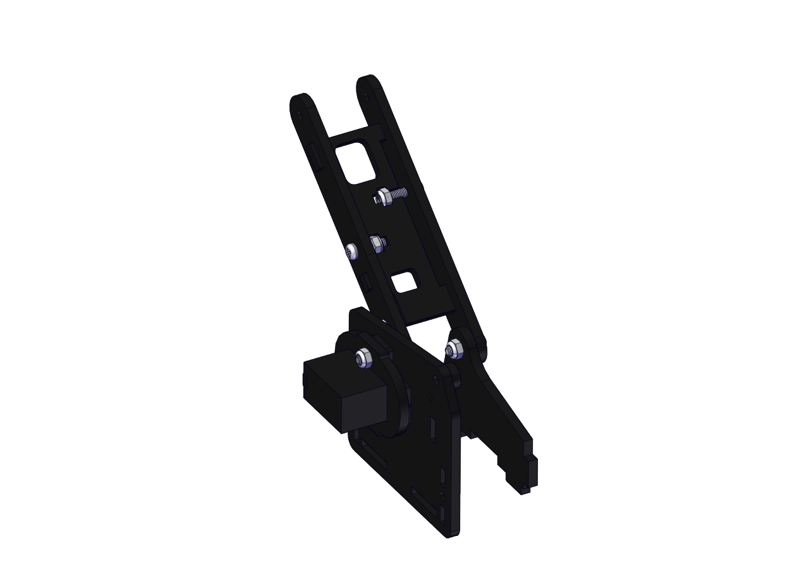
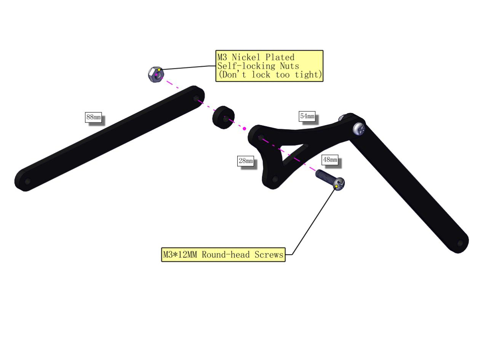
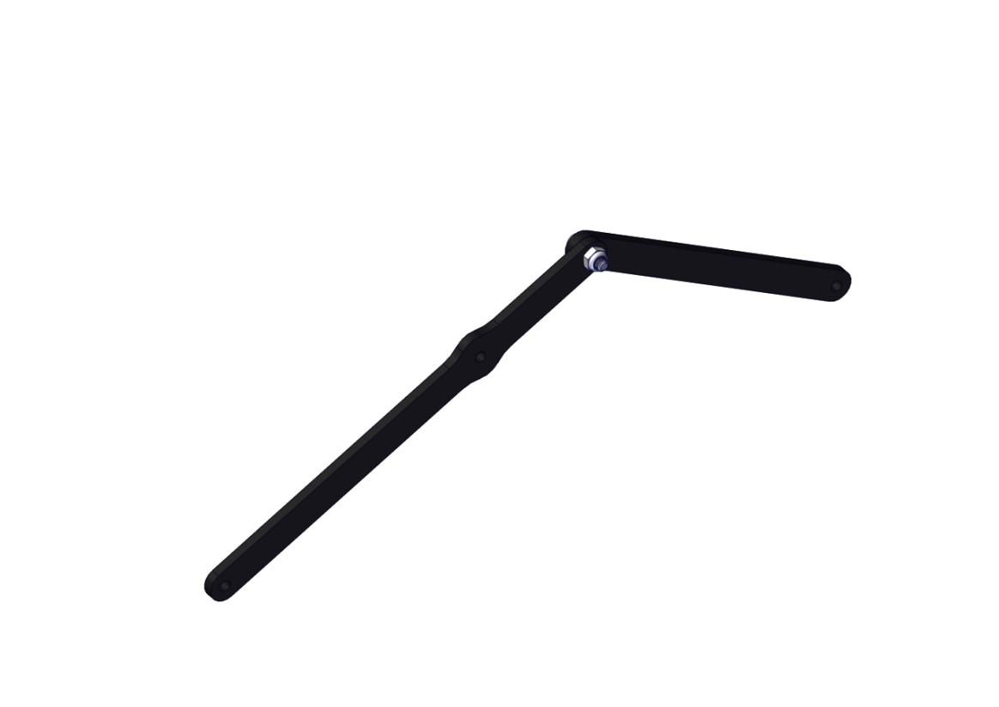
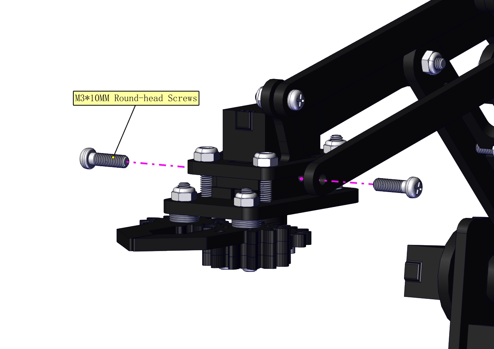
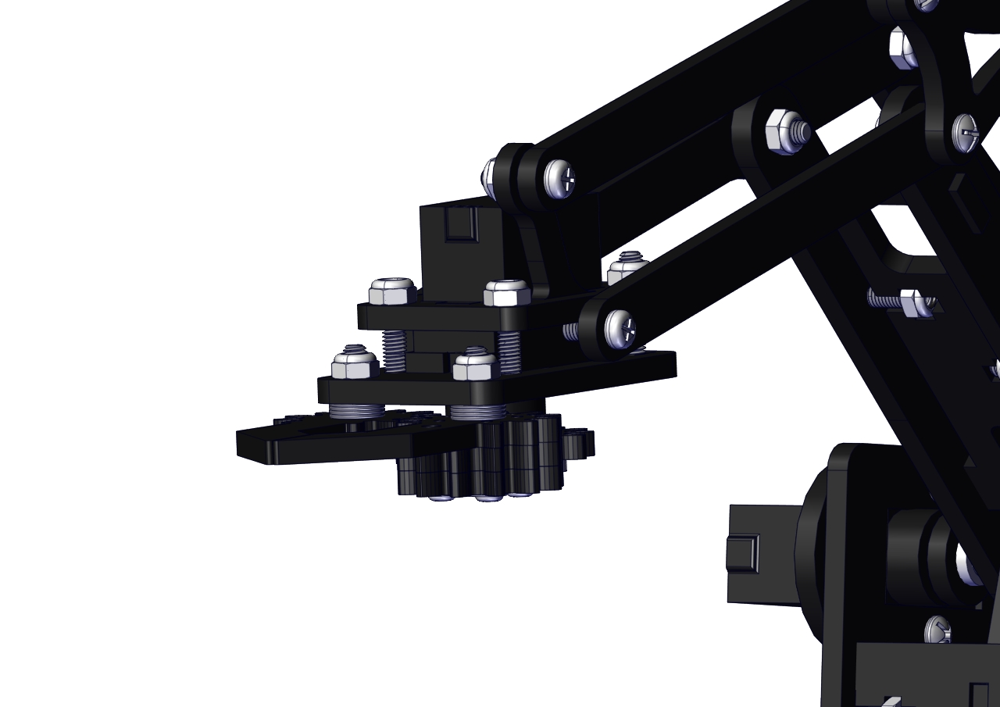

# 2. Product installation

(1) Install the base of the robotic arm

Components Needed:


The base is installed successfully.



(2)  Mount servos onto the base

Components Needed:


**Assemble a servo(left) onto the left board**

Components Needed:


**a.Initialize the left servo**

Attach this left servo to G, V and S（6）of servo motor driver shield, upload the following code, plug in power and press the rest button on the V4.0 board. Then the left servo rotates to 180°.


Download code file：[Servo_180](./Servo_180.7z)

**Test Code：**

```
#include <Servo.h>
Servo myservo; // create servo object to control a servo

void setup()
{
    Serial.begin(9600);
    delay(1000);
}

void loop()
{
    myservo.attach(6); // Change pin to adjust one by one
    myservo.write(180); //Angle
    delay(1000);
}
```

 Fix the arm：


**Mount a servo(right) onto the right board**

Components Needed


**Note the breach direction of acrylic board**


b. Initialize the right servo

Attach this left servo to G, V and S（A0）of servo motor driver shield, upload the following code, plug in power and press the rest button on the V4.0 board. Then the left servo rotates to 0°.


Download code file：[Servo_0](./Servo_0.7z)

**Set the servo to 0°：**

```
#include <Servo.h>
Servo myservo; // create servo object to control a servo

void setup()
{
    Serial.begin(9600);
    delay(1000);
}

void loop()
{
    myservo.attach(A0); // Change pin to adjust one by one
    myservo.write(0); //Angle
    delay(1000);
}
```


**Install the holder part**


**Fix the left part and the mount part together**




Fix the right part and the ABS holder together.


Note the direction of the ABS holder.


**Install the middle part**








Assemble the claw


**c. Initialize the servo**

Attach this left servo to G, V and S（9）of servo motor driver shield, upload the following code, plug in power and press the rest button on the V4.0 board. Then the left servo rotates to 0°


**Set the servo to 0°：**

Download code file：[1Servo_0.7z](./1Servo_0.7z)

```
#include <Servo.h>
Servo myservo; // create servo object to control a servo

void setup()
{
    Serial.begin(9600);
    delay(1000);
}

void loop()
{
    myservo.attach(9); // Change pin to adjust one by one
    myservo.write(0); //Angle
    delay(1000);
}
```

**Mount gear wheels：**


**Components Needed:**








**Initialize the servo**

Attach this left servo to G, V and S（A1）of sevro motor driver shield, upload the following code, plug in power and press the rest button on the V4.0 board. Then the left servo rotates to 80°.

**Set the servo to 80°：**

Download code file：[Servo_80.7z](./Servo_80.7z)

Test Code

```
#include <Servo.h>
Servo myservo; // create servo object to control a servo

void setup()
{
    Serial.begin(9600);
    delay(1000);
}

void loop()
{
    myservo.attach(A1); // Change pin to adjust one by one
    myservo.write(80); //Angle
    delay(1000);
}
```

**Install the robotic arm：**


**Mount the control part**


Wiring-up Guide


 **Joint Rotation and Servo Angle Settings**

| Name                   | 0°                                            | 180°                       |
| ---------------------- | --------------------------------------------- | -------------------------- |
| Servo 1（baseplate）   | Rotate toward the rightmost                   | Rotate toward the leftmost |
| Servo 2 （right side） | Rocker arm connected to Servo 2 draws back    | stretch out                |
| Servo 3 （left side）  | Rocker arm connected to Servo 3 stretches out | draw back                  |
| Servo 4 (clamp claw)   | close                                         | open                       |

**Pin Control**

| Name                 | IO Pin |
| -------------------- | ------ |
| Servo 1 (baseplate)  | A1     |
| Servo 2 (right side) | A0     |
| Servo 3 (left side)  | 6      |
| Servo 4 (clamp claw) | 9      |
| Right Joystick X     | A2     |
| Right Joystick Y     | A5     |
| Right Joystick Z (B) | 7      |
| Left Joystick X      | A3     |
| Left Joystick Y      | A4     |
| Left Joystick Z(B)   | 8      |
| D1/DAT of PS2        | 12     |
| D0/CMD of PS2        | 11     |
| CE/SEL of PS2        | 10     |
| CLK of PS2           | 13     |

