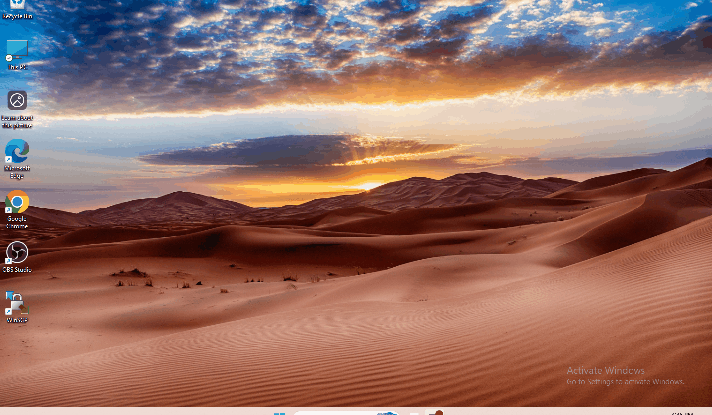
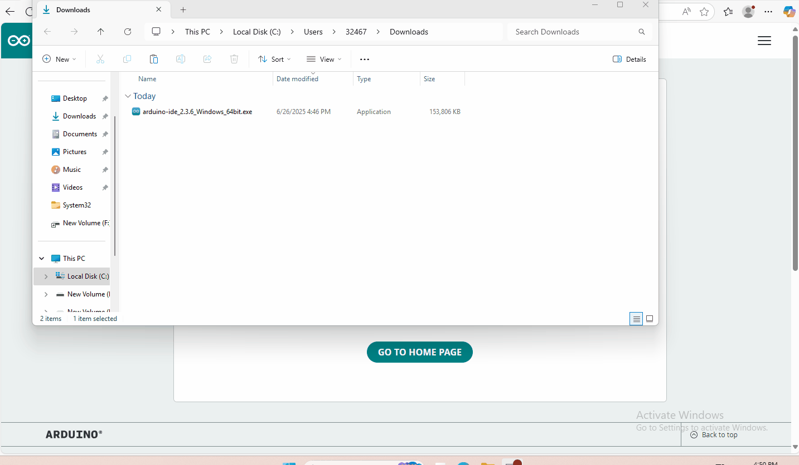
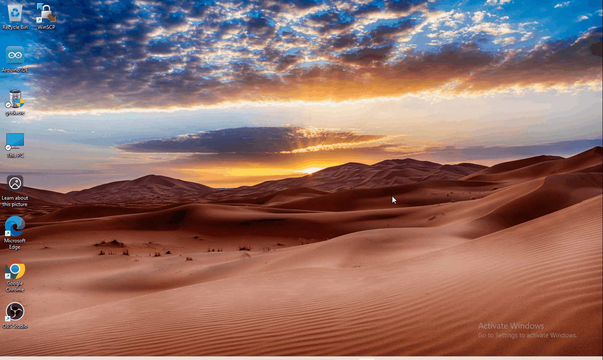
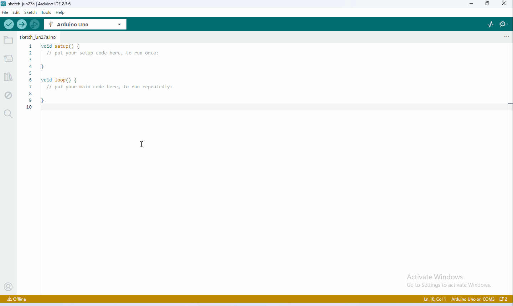

# 4. Arduino Tutorial

## 4.1 Data download

Arduino information contains library files and project code ,please click to download for follow-up study.

Data download:[Arduino Data](./Arduino.7z)

APP download:

Android：  https://xiazai.keyesrobot.cn/APP/keyes%20arm.apk

IOS：          https://apps.apple.com/cn/app/keyes-arm/id1487006837

## 4.2 Software Download

When we get control board, we need to download Arduino IDE and driver firstly. 

You could download Arduino IDE from the official website:<https://www.arduino.cc/en/software>.

There are various versions for Arduino,just download a suitable version for your system,we will take WINDOWS system as an example to show you how to download and install.

You just need to click JUSTDOWNLOAD,then click the downloaded file to install it.

And when the ZIP file is downloaded,you can directly unzip and start it.

## 4.3 Set Arduino IDE 

1、Connecting the board to the computer.

## 4.4 Add Library

What are Libraries ?

Libraries are a collection of code that makes it easy for you to connect to a sensor,display, module, etc.  

There are hundreds of additional libraries available on the Internet for download. 

 We will introduce the most simple way for you to add libraries . 

