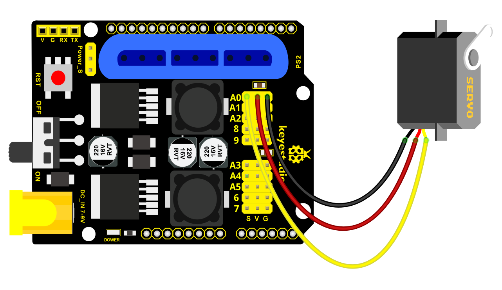

### Project 1 Servo Control

**Description**

In the previous projects, we set the square wave and angles of servos.

Now, we use libraries of servos to control the angle of a servo. We only need to put the servo folder in the libraries folder where the Arduino IDE location is installed, then open the Arduino IDE, the library file will take effect.

**Connection Diagram**



**Test Code 1:**

```
#include  <Servo.h >
Servo myservo; // create servo object to control a servo

void setup()
{
    Serial.begin(9600);
    delay(1000);
}

void loop()
{
    myservo.attach(A0); // modify each pin to adjust
    myservo.write(0); // angle value
    delay(1000);
}
```

**Test Result:**

Stack the drive shield onto V4.0 board and connect the servo motor, upload the code, plug in power and press the reset button. Then the servo will automatically rotate to 0°.

**Automatic Movement**

**Description:**

In the previous section, you have learned to set the servo angle. In fact, we just need to continually change angles of 4 servo, thus make the 4DOF robot arm operate different motions.

**Hookup Guide:**


**Test Code 2:**

```
 #include  <Servo.h >
Servo myservo1; // create servo object to control a servo
Servo myservo2;
Servo myservo3;
Servo myservo4;
int pos1=80, pos2=60, pos3=130, pos4=0;

void setup()
{
    myservo1.attach(A1); // attaches the servo on pin 9 to the servo object
    myservo2.attach(A0);
    myservo3.attach(6);
    myservo4.attach(9);
    myservo1.write(pos1);
    delay(1000);
    myservo2.write(pos2);
    myservo3.write(pos3);
    myservo4.write(pos4);
    delay(1500);
}

void loop()
{
    // turn right
    for(pos1;pos1 >0;pos1--)
    {
        myservo1.write(pos1);
        delay(5); // delay 5ms（used to adjust the servo speed）
    }
    delay(1000);
    //open the claw
    for(pos4;pos4 <100;pos4++)
    {
    	myservo4.write(pos4);
    }
    delay(1000);
    // right servo rotates to 100 degrees
    for(pos2;pos2 >50;pos2--)
    {
        myservo2.write(pos2);
        delay(5);
    }
    // left servo rotates to 5 degrees
    for(pos3;pos3 >50;pos3--)
    {
        myservo3.write(pos3);
        delay(5);
    }
    delay(1500);
    // close the claw
    for(pos4;pos4 >0;pos4--)
    {
    	myservo4.write(pos4);
    }
    delay(1000);
    // left servo rotates to100 degrees, rocker arm lifts.
    for(pos3;pos3 <120;pos3++)
    {
        myservo3.write(pos3);
        delay(5);
    }
    delay(1000);
    // turn to left
    for(pos1;pos1 <180;pos1++)
    {
        myservo1.write(pos1);
        delay(5);
    }
    delay(1000);
    // Lower the arm
    for(pos3;pos3 >50;pos3--)
    {
        myservo3.write(pos3);
        delay(5);
    }
    delay(1000);
    // open the claw
    for(pos4;pos4 <100;pos4++)
    {
    	myservo4.write(pos4);
    }
    delay(1000);
    // lift up the arm
    for(pos3;pos3 <120;pos3++)
    {
        myservo3.write(pos3);
        delay(5);
    }
    delay(1000);
    // close the claw
    for(pos4;pos4 >0;pos4--)
    {
    	myservo4.write(pos4);
    }
    delay(1000);
}
```

**Test Result:**

Stack the driver shield onto V4.0 board and connect the servo motor, upload well the code., plug in power and press the reset button. Then the robot arm will rotate to right, stretch out the arm, lower and enable claw; then it will withdraw, lift, rotate to left, stretch out, lower and make claw open.

This series of actions will be continuous.