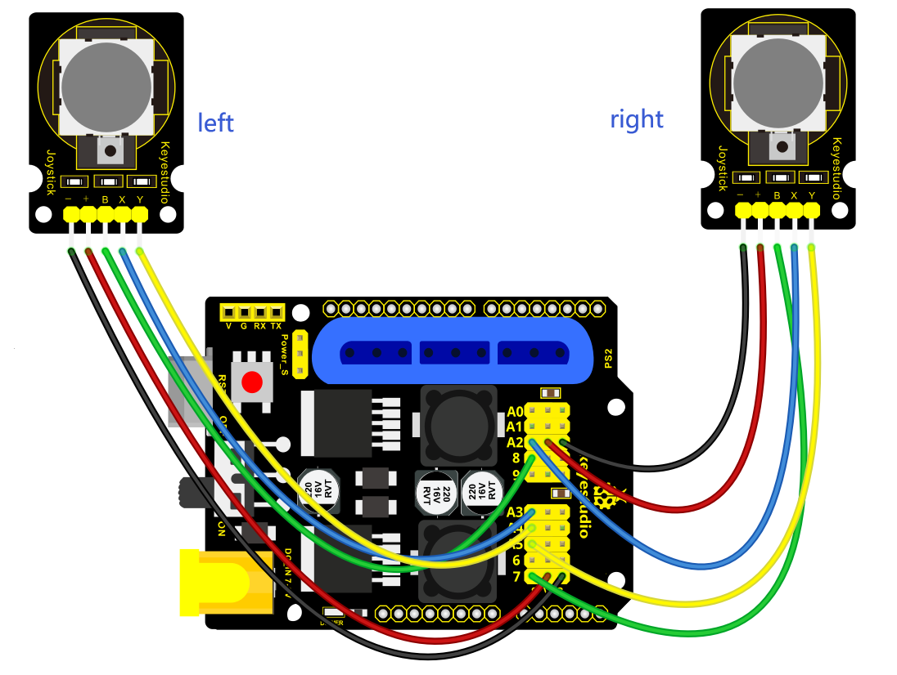
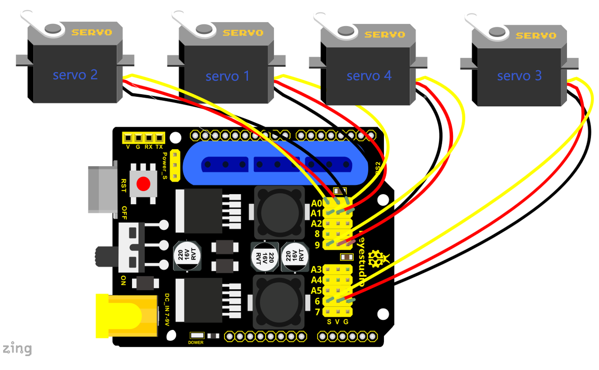

### Project 3  Dual-Joystick Control

**Description:**

In the previous section, we have introduced how to use 4 Servo to control the robot arm. Next, combine those two experiments. Use two Joystick modules to control 4DOF robot arm realize different motions.

At first, set the boot posture. The Joystick control is shown as below table.

| **Right Joystick** | **Servo**                                                    | **Left Joystick** | **Servo**                                                    |
| ------------------ | ------------------------------------------------------------ | ----------------- | ------------------------------------------------------------ |
| X1  <50            | Servo 1 gradually reduces to 0° (push the right joystick to the right, the servo that controls the arm rotation turns right, and stops at 0° ) | X2  <50           | Servo 4 gradually reduces to 0° (push the left joystick to the right, the claw is closed) |
| X1  >1000          | Servo 1 gradually increases to 180° (push the right joystick to the left, the servo that controls the arm rotation turns left, and stops at 180° ) | X2  >1000         | Servo 4 gradually increases to 180° (push the left joystick to the left, the claw opens) |
| Y1  >1000          | Servo 2 gradually reduces to 0° ( that is, lift up the robot upper arm) | Y2  >1000         | Servo 3 gradually reduces to 35° ( that is, stretch out the robot lower arm) |
| Y1  <50            | Servo 2 gradually reduces to 180° ( that is, lower the robot upper arm) | Y2  <50           | Servo 3 gradually increases to 180° ( that is, draw back the robot lower arm) |

**Hookup Guide:**



**Test Code **

```
#include <Servo.h>  // add the servo libraries 
Servo myservo1;  // create servo object to control a servo
Servo myservo2;
Servo myservo3;
Servo myservo4;  

int pos1=80, pos2=60, pos3=130, pos4=0;  // define the variable of 4 servo angle,and assign the initial value (that is the boot posture angle value) 

const int right_X = A2; // define the right X pin to A2 
const int right_Y = A5; // define the right Y pin to A5
const int right_key = 7; // define the right key pin to 7（that is the value of Z）

const int left_X = A3; // define the left X pin to A3
const int left_Y = A4;  // define the left X pin to A4
const int left_key = 8; //define the left key pin to 8（that is the value of Z）

int x1,y1,z1;  // define the variable, used to save the joystick value it read.
int x2,y2,z2;


void setup() 
{
  
  // boot posture 
  myservo1.write(pos1);  
  delay(1000);
  myservo2.write(pos2);
  myservo3.write(pos3);
  myservo4.write(pos4);
  delay(1500);

  pinMode(right_key, INPUT);   // set the right/left key to INPUT
  pinMode(left_key, INPUT);
  Serial.begin(9600); //  set the baud rate to 9600
}

void loop() 
{
  myservo1.attach(A1);  // set the control pin of servo 1 to A1
  myservo2.attach(A0);  // set the control pin of servo 2 to A0
  myservo3.attach(6);   //set the control pin of servo 3 to D6
  myservo4.attach(9);   // set the control pin of servo 4 to D9

  x1 = analogRead(right_X); //read the right X value 
  y1 = analogRead(right_Y);  // read the right Y value 
  z1 = digitalRead(right_key);  //// read the right Z value 
  
  x2 = analogRead(left_X);  //read the left X value
  y2 = analogRead(left_Y);  //read the left Y value 
  z2 = digitalRead(left_key);  // read the left Z value  
  //delay(5);  // lower the speed overall

  // claw
  zhuazi();
  // rotate
  zhuandong();
  // upper arm
  xiaobi();
  //lower arm
  dabi();
}

//claw
void zhuazi()
{
    //claw
  if(x2<50) // if push the left joystick to the right
  {
      pos4=pos4-2;  //current angle of servo 4 subtracts 2（change the value you subtract, thus change the closed speed of claw）
      //Serial.println(pos4);
      myservo4.write(pos4);  // servo 4 operates the action, claw is gradually closed.
      delay(5);
      if(pos4<2)  // if pos4 value subtracts to 2, the claw in 37 degrees we have tested is closed.
      {            //（should change the value based on the fact）
        pos4=2;   // stop subtraction when reduce to 2
      }
   }
  if(x2>1000) //// if push the left joystick to the left 
  {
      pos4=pos4+8; // current angle of servo 4 plus 8（change the value you plus, thus change the open speed of claw）
      //Serial.println(pos4);
      myservo4.write(pos4); // servo 4 operates the motion, the claw gradually opens.
      delay(5);
      if(pos4>108)  // limit the largest angle when open the claw  
      {
        pos4=108;
      }
  }
}
//******************************************************
 // turn
void zhuandong()
{
  if(x1<50)  // if push the right joystick to the right
  {
    pos1=pos1-1;  //pos1 subtracts 1
    myservo1.write(pos1);  // servo 1 operates the motion, the arm turns right.
    delay(5);
    if(pos1<1)   // limit the angle when turn right
    {
      pos1=1;
    }
  }
  if(x1>1000)  // if push the right joystick to the let
  {
    pos1=pos1+1;  //pos1 plus 1
    myservo1.write(pos1);  // arm turns left 
    delay(5);
    if(pos1>180)  // limit the angle when turn left 
    {
      pos1=180;
    }
  }
}

//**********************************************************/
//upper arm
void xiaobi()
{
    if(y1>1000) // if push the right joystick upward
  {
    pos2=pos2-1;
    myservo2.write(pos2); // the upper arm will lift
    delay(5);
    if(pos2<0)  // limit the lifting angle
    {
      pos2=0;
    }
  }
  if(y1<50)  // if push the right joystick downward
  {
    pos2=pos2+1;  
    myservo2.write(pos2);  // upper arm will go down  
    delay(5);
    if(pos2>180)  // limit the angle when go down
    {
      pos2=180;
    }
  }
}

//*************************************************************/
// lower arm
void dabi()
{
  if(y2<50)  // if push the left joystick upward 
  {
    pos3=pos3+1;
    myservo3.write(pos3);  // lower arm will stretch out 
    delay(5);
    if(pos3>180)   // limit the stretched angle 
    {
      pos3=180;
    }
  }
  if(y2>1000)  // if push the left joystick downward
  {
    pos3=pos3-1;
    myservo3.write(pos3);  // lower arm will draw back
    delay(5);
    if(pos3<35)  // limit the retracted angle 
    {
      pos3=35;
    }
  }
}
```

**Test Result:**

Upload the code to main board and stack the shield onto it and wire them up, then 4DOF robot arm will keep the initial position. You can control the robot arm with Joysticks.