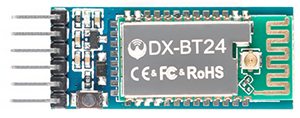
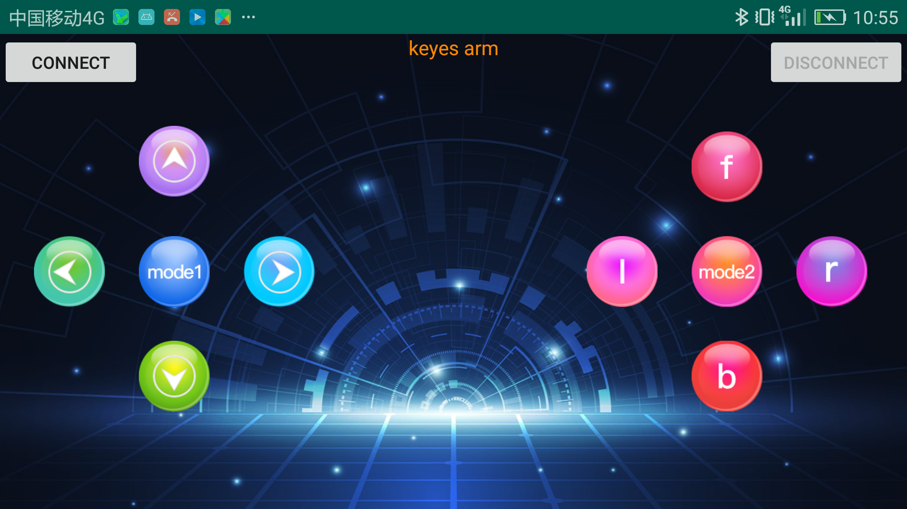
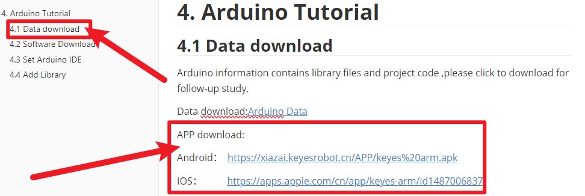
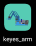
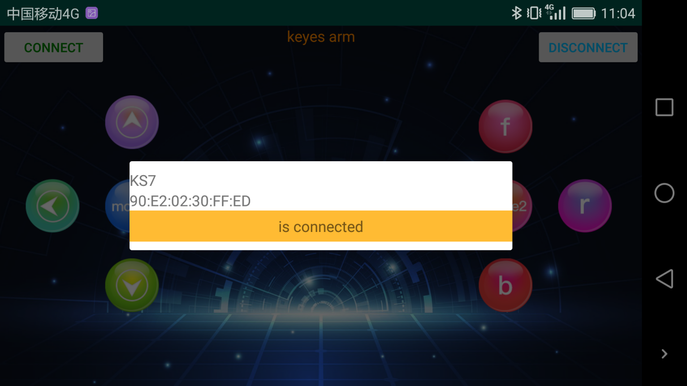
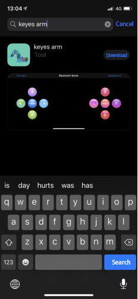
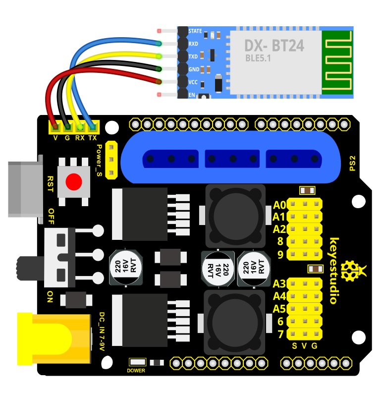
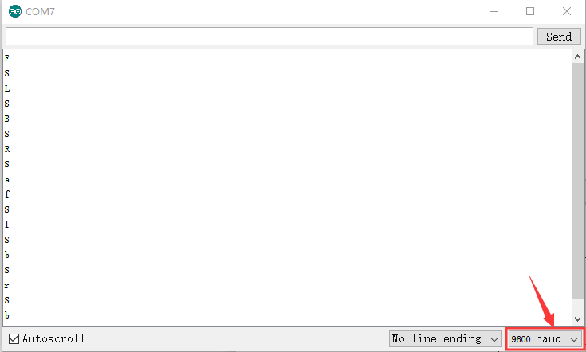

### Project 5 BT-controlled Robot Arm

**Principle of BT Control**

Bluetooth technology is a wireless standard technology that can realize short-distance data exchange between fixed equipment, mobile equipment andpersonal area network (UHF radio waves in the ISM band of 2.4-2.485GHz). In the kit, we equip with the BT-24 Bluetooth module. BT-24 Bluetooth module supports Android and IOS system.

In the experiment, we default the BT-24 Bluetooth module as the slave and the mobile phone as the master.We especially design APP to control robotic arm(Android /IOS system).



**Specification**

Bluetooth protocol: Bluetooth Specification V5.1 BLE

Working distance: In an open environment, achieve 40m ultra-long distance communication

Operating frequency: 2.4GHz ISM band

Communication interface: UART

Bluetooth certification: in line with FCC CE ROHS REACH certification standards

Serial port parameters: 9600, 8 data bits, 1 stop bit, invalid bit, no flow control

Power: 5V DC

Operating temperature: –10 to +65 degrees Celsius

**Bluetooth Control Key Test**

**Description**

Next, we are going to introduce the use method for BT-24 Bluetooth module. To easily use the BT-24 Bluetooth module to control the robot arm, we particularly design the APP control. Shown below.



There are 10 control keys on the App. When connect well the HC-06 Bluetooth module to Android phone using our APP, press the control key, Android phone will receive a corresponding value.

When programming, you can set the function for the corresponding value. So in the experiment, we will test each key to get the corresponding value.

Installation Steps for Android system:

**APP for Android mobile：**

Please download the APP here.



**Note: Allow APP to access “location” in settings of your cellphone when connecting to Bluetooth module, otherwise, Bluetooth may not be connected.**

This are operating steps as below, the interface for Android and ios system is same.

**Android System:**

1. Download and installthe interface shown below:

   

2. Upload code and power on, Led of Bluetooth module blinks. Start Bluetooth and open App to click “CONNECT” to connect.

   

3. Upload code on control board, after power-on, LED blinks on Bluetooth module. Start Bluetooth and open App to click “connect”, Bluetooth is connected.

   

**For IOS system：**

1. Open App Store.

2. Search “keyes arm”on APP Store，then click “downlaod”.

   

   Special Note: Remove the Bluetooth module please, when uploading the Test Code. Otherwise, the program will fail to upload. After uploading the Test Code, then connect the Bluetooth and Bluetooth module to pair.

**Connection Diagram**



**Test Code 1**

```
void setup()
{
	Serial.begin(9600); // set the serial baud rate to 9600
}

void loop()
{
    char val; // define a variable, used to receive the value read from Bluetooth.
    if(Serial.available()) // if receive the value
    {
        val = Serial.read(); // assign the value read to val
        Serial.println(val);
    }
}
```

After connecting Bluetooth module, open serial port monitor to set baud rate to

1.    Press control keys on App, the serial port prints out the corresponding
      control character. As shown below:



**Test Result:**

The functions of control keys:

|  | Connect APP to bt-24 Bluetooth module |                                                    |
| ---------------------------------------- | ------------------------------------- | -------------------------------------------------- |
|  | Turn off Bluetooth                    |                                                    |
|  | Press to send“F” Release to send“S”   | Left servo goes front Left servo stops motion      |
|  | Press to send “L” Release to send“S”  | Clamp claw opens Clamp claw stops                  |
|  | Mode 1                                |                                                    |
|  | Press to send “R” Release to send“S”  | Clamp claw closes Clamp claw stops                 |
|  | Press to send “B” Release to send“S”  | Left Servo draws back Left Servo stops motion      |
|  | Press to send “f” Release to send“S”  | Right servo stretches out Right servo stops motion |
|  | Press to send “l” Release to send“S”  | The base servo turns left Base servo stops         |
|  | Mode 2                                |                                                    |
|  | Press to send “r” Release to send“S”  | Base Servo turns right Base Servo stops            |
|  | Press to send “b” Release to send“S”  | Right Servo draws back Right Servo stops           |

**Bluetooth Controls the Robotic Arm**

**Description**

We introduced the control method of the 4-DOF robot arm and bt-24 Bluetooth module. In this experiment, we’ll control 4DOF robotic arm movement via APP.

Note: After uploading test code successfully, unplug the USB data cable and power up via external power supply and control 4 DOF robot arm movement via APP.

**Connection Diagram**


**Test Code 2**

```
#include <Servo.h>  // add the servo libraries
Servo myservo1;  // create servo object to control a servo
Servo myservo2;
Servo myservo3;
Servo myservo4;
int pos1=80, pos2=60, pos3=130, pos4=0;  // define the variable of 4 servo angle and assign the initial value( that is the boot posture angle value)
char val;
char val2;

void setup()
{
   // boot posture
  myservo1.write(pos1);  
  delay(1000);
  myservo2.write(pos2);
  myservo3.write(pos3);
  myservo4.write(pos4);
  delay(1500);

  Serial.begin(9600); //  set the baud rate to 9600
}

void loop() 
{
  myservo1.attach(A1);  // set the control pin of servo 1 to A1
  myservo2.attach(A0);  // set the control pin of servo 2 to A0
  myservo3.attach(6);   // set the control pin of servo 3 to D6
  myservo4.attach(9);   // set the control pin of servo 4 to D9

  if(Serial.available())   // if receive the data
  {
    val=Serial.read();    // read the received data
    val2=val;             //Give the value of val to val2
    Serial.println(val);
   
    switch(val)   
    {
      case 'L':  T_left();  break;   // execute the corresponding function when receive the value 
      case 'R':  T_right();  break;
      case 'f':  RF();  break;
      case 'b':  rb();  break;
      case 'F':  ZK();  break;
      case 'B':  ZB();  break;
      case 'l':  LF();  break;
      case 'r':  lb();  break;
      case 'S':  servo_stop();  break;       //stop instruction 
    }

  }
  else
  {
      switch(val2)                //When the button is pressed and not released, 
     {                            //"else" is executed because Bluetooth does not send characters,
                                  // and the value of val2 is the value of the previously pressed button, 
                                  //so the command of pressing the button will be repeated
    
      case 'L':  T_left();  break;   // execute the corresponding function when receive the value 
      case 'R':  T_right();  break;
      case 'f':  RF();  break;
      case 'b':  rb();  break;
      case 'F':  ZK();  break;
      case 'B':  ZB();  break;
      case 'l':  LF();  break;
      case 'r':  lb();  break;
      case 'S':  servo_stop();  break;     //stop instruction 
    }
   }
}
//**************************************************
// turn left
void T_left()
{
    pos1=pos1+1;
    myservo1.write(pos1);
    delay(5);
    if(pos1>180)
    {
      pos1=180;
    }
}
//turn right 
void T_right()
{
    pos1=pos1-1;
    myservo1.write(pos1);
    delay(5);
    if(pos1<1)
    {
      pos1=1;
    }
}
//********************************************
//open the claw
void ZK()
{
      pos4=pos4-2;
      Serial.println(pos4);
      myservo4.write(pos4);
      delay(5);
      if(pos4<2)
      {
        pos4=0;
      }
}
// close the claw
void ZB()
{
    pos4=pos4+8;
      Serial.println(pos4);
      myservo4.write(pos4);
      delay(5);
      if(pos4>108)
      {
        pos4=108;
      }
}

//******************************************
// the upper arm will lift up 
void RF()
{
    pos2=pos2-1;
    myservo2.write(pos2);
    delay(5);
    if(pos2<0)
    {
      pos2=0;
    }
}
// the upper arm will go down 
void rb()
{
    pos2=pos2+1;
    myservo2.write(pos2);
    delay(5);
    if(pos2>180)
    {
      pos2=180;
    }
}

//***************************************
// the lower arm will stretch out 
void lb()
{
  pos3=pos3+1;
    myservo3.write(pos3);
    delay(5);
    if(pos3>180)
    {
      pos3=180;
    }
}
// the lower arm will draw back 
void LF()
{
  pos3=pos3-1;
    myservo3.write(pos3);
    delay(5);
    if(pos3<35)
    {
      pos3=35;
    }
}

void servo_stop()
{
   
    myservo1.write(pos1);
    myservo2.write(pos2);
    myservo3.write(pos3); 
    myservo4.write(pos4);
   
}
```

**Test Result:**

Upload the code, connect it up and power on, after connecting the Bluetooth APP, press the key to control the robot arm do commanded motions.