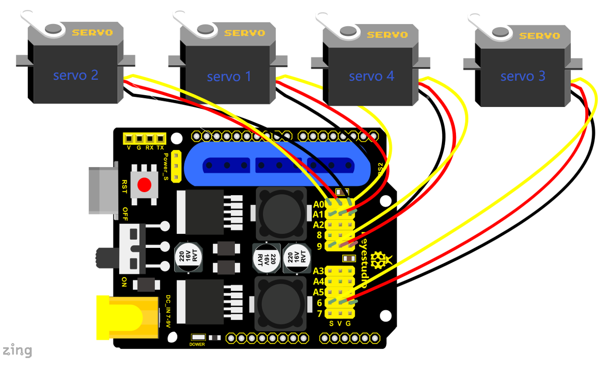

### Project 6 PS2-controlled Robot Arm (Extension)

#### 6.1 PS2 Joypad Key Test

**Description:**

On the drive shield there is a PS2 Joystick connector, which is easy for you to control the 4DOF robot arm using the PS2 Joypad. But you need to purchase it by yourself because the PS2 Joypad is not included in the kit.

When use the PS2 Joypad to control the robot arm, first need to get the corresponding character of each key on the PS2 Joypad.

So this experiment will help you test the character of each key on the PS2 Joypad.

After connecting the Joypad, should upload the test program on Arduino IDE. But before testing, should place the **PS2X_lib** folder inside the libraries folder of Arduino IDE directory.

Uploading the code, open the serial monitor, connect the PS2 Joypad. When press down the key, you should see the corresponding character on the monitor.

**Test Code **

```
#include <PS2X_lib.h>  //for v1.6

PS2X ps2x; // create PS2 Controller Class

//right now, the library does NOT support hot pluggable controllers, meaning 
//you must always either restart your Arduino after you conect the controller, 
//or call config_gamepad(pins) again after connecting the controller.
int error = 0; 
byte type = 0;
byte vibrate = 0;

void setup(){
 Serial.begin(57600);

 //CHANGES for v1.6 HERE!!! **************PAY ATTENTION*************
  
 error = ps2x.config_gamepad(13,11,10,12, true, true);   //setup pins and settings:  GamePad(clock, command, attention, data, Pressures?, Rumble?) check for error
 
 if(error == 0)
 {
  Serial.println("Found Controller, configured successful");
  Serial.println("Try out all the buttons, X will vibrate the controller, faster as you press harder;");
  Serial.println("holding L1 or R1 will print out the analog stick values.");
  Serial.println("Go to www.billporter.info for updates and to report bugs.");
 }
   
  else if(error == 1)
   Serial.println("No controller found, check wiring, see readme.txt to enable debug. visit www.billporter.info for troubleshooting tips");
   
  else if(error == 2)
   Serial.println("Controller found but not accepting commands. see readme.txt to enable debug. Visit www.billporter.info for troubleshooting tips");
   
  else if(error == 3)
   Serial.println("Controller refusing to enter Pressures mode, may not support it. ");
   
   //Serial.print(ps2x.Analog(1), HEX);
   
   type = ps2x.readType(); 
     switch(type) {
       case 0:
        Serial.println("Unknown Controller type");
       break;
       case 1:
        Serial.println("DualShock Controller Found");
       break;
       case 2:
         Serial.println("GuitarHero Controller Found");
       break;
     }
  
}

void loop(){
   /* You must Read Gamepad to get new values
   Read GamePad and set vibration values
   ps2x.read_gamepad(small motor on/off, larger motor strenght from 0-255)
   if you don't enable the rumble, use ps2x.read_gamepad(); with no values
   
   you should call this at least once a second
   */
   
   
   
 if(error == 1) //skip loop if no controller found
  return; 
  
 if(type == 2)
 { //Guitar Hero Controller
   
   ps2x.read_gamepad();          //read controller 
   
   if(ps2x.ButtonPressed(GREEN_FRET))
    Serial.println("Green Fret Pressed");
   if(ps2x.ButtonPressed(RED_FRET))
    Serial.println("Red Fret Pressed");
   if(ps2x.ButtonPressed(YELLOW_FRET))
    Serial.println("Yellow Fret Pressed");
   if(ps2x.ButtonPressed(BLUE_FRET))
    Serial.println("Blue Fret Pressed");
   if(ps2x.ButtonPressed(ORANGE_FRET))
    Serial.println("Orange Fret Pressed");
   if(ps2x.ButtonPressed(STAR_POWER))
    Serial.println("Star Power Command");
   if(ps2x.Button(UP_STRUM))          //will be TRUE as long as button is pressed
    Serial.println("Up Strum");
   if(ps2x.Button(DOWN_STRUM))
    Serial.println("DOWN Strum");
  
 
    if(ps2x.Button(PSB_START))                   //will be TRUE as long as button is pressed
         Serial.println("Start is being held");
    if(ps2x.Button(PSB_SELECT))
         Serial.println("Select is being held");

    
    if(ps2x.Button(ORANGE_FRET)) // print stick value IF TRUE
    {
        Serial.print("Wammy Bar Position:");
        Serial.println(ps2x.Analog(WHAMMY_BAR), DEC); 
    } 
 }

 else { //DualShock Controller
  
    ps2x.read_gamepad(false, vibrate);          //read controller and set large motor to spin at 'vibrate' speed
    
    if(ps2x.Button(PSB_START))                   //will be TRUE as long as button is pressed
         Serial.println("Start is being held");
    if(ps2x.Button(PSB_SELECT))
         Serial.println("Select is being held");
         
         
     if(ps2x.Button(PSB_PAD_UP)) {         //will be TRUE as long as button is pressed
       Serial.print("Up held this hard: ");
       Serial.println(ps2x.Analog(PSAB_PAD_UP), DEC);
      }
      if(ps2x.Button(PSB_PAD_RIGHT)){
       Serial.print("Right held this hard: ");
        Serial.println(ps2x.Analog(PSAB_PAD_RIGHT), DEC);
      }
      if(ps2x.Button(PSB_PAD_LEFT)){
       Serial.print("LEFT held this hard: ");
        Serial.println(ps2x.Analog(PSAB_PAD_LEFT), DEC);
      }
      if(ps2x.Button(PSB_PAD_DOWN)){
       Serial.print("DOWN held this hard: ");
     Serial.println(ps2x.Analog(PSAB_PAD_DOWN), DEC);
      }   
  
    
      vibrate = ps2x.Analog(PSAB_BLUE);        //this will set the large motor vibrate speed based on 
                                              //how hard you press the blue (X) button    
    
    if (ps2x.NewButtonState())               //will be TRUE if any button changes state (on to off, or off to on)
    {
     
       
         
        if(ps2x.Button(PSB_L3))
         Serial.println("L3 pressed");
        if(ps2x.Button(PSB_R3))
         Serial.println("R3 pressed");
        if(ps2x.Button(PSB_L2))
         Serial.println("L2 pressed");
        if(ps2x.Button(PSB_R2))
         Serial.println("R2 pressed");
        if(ps2x.Button(PSB_GREEN))
         Serial.println("Triangle pressed");
         
    }   
         
    
    if(ps2x.ButtonPressed(PSB_RED))             //will be TRUE if button was JUST pressed
         Serial.println("Circle just pressed");
         
    if(ps2x.ButtonReleased(PSB_PINK))             //will be TRUE if button was JUST released
         Serial.println("Square just released");     
    
    if(ps2x.NewButtonState(PSB_BLUE))            //will be TRUE if button was JUST pressed OR released
         Serial.println("X just changed");    
    
    
    if(ps2x.Button(PSB_L1) || ps2x.Button(PSB_R1)) // print stick values if either is TRUE
    {
        Serial.print("Stick Values:");
        Serial.print(ps2x.Analog(PSS_LY), DEC); //Left stick, Y axis. Other options: LX, RY, RX  
        Serial.print(",");
        Serial.print(ps2x.Analog(PSS_LX), DEC); 
        Serial.print(",");
        Serial.print(ps2x.Analog(PSS_RY), DEC); 
        Serial.print(",");
        Serial.println(ps2x.Analog(PSS_RX), DEC); 
    } 
    
    
 }
 
 
 delay(50);
     
}

```

**Test Result:**

Stack the drive shield onto V4.0 and upload the code. Connecting the PS2 Joypad, open the serial monitor and set the baud rate to 57600. When press down the key or push the rocker, you should see the corresponding character showed on the monitor.

#### 6.2 PS2 Joypad Control

**Description:**

In the previous section, we have showed how to use Joystick module to control the robot arm. It is almost the same for you to control the 4DOF robot arm using the PS2 Joypad.

**PS2 Joystick Control**

| **Right Joystick**     | **Robot Arm**            | **Left Joystick**      | **Robotic Claw**                |
| ---------------------- | ------------------------ | ---------------------- | ------------------------------- |
| Push to the right side | Rotate to right          | Push to the right side | close                           |
| Push to the left side  | Rotate to left           | Push to the left side  | open                            |
| Push forward           | The small arm will lift  | Push forward           | The large arm will move forward |
| Push back              | The small arm will lower | Push back              | The large arm will move back    |

**Connection Diagram** 


**Test Code **

```
#include <PS2X_lib.h>

PS2X ps2x; // create PS2 Controller Class


//right now, the library does NOT support hot pluggable controllers, meaning 
//you must always either restart your Arduino after you connect the controller, 
//or call config_gamepad(pins) again after connecting the controller.
int error = 0; 
byte vibrate = 0;

#include <Servo.h>  // add the servo libraries 
Servo myservo1;  // create servo object to control a servo
Servo myservo2;
Servo myservo3;
Servo myservo4;

int pos1=80, pos2=60, pos3=130, pos4=0;  // define the variable of 4 servo angle and assign the initial value( that is the boot posture angle value)

void setup(){
 Serial.begin(57600);

// boot posture
  myservo1.write(pos1);  
  delay(1000);
  myservo2.write(pos2);
  myservo3.write(pos3);
  myservo4.write(pos4);
  delay(1500);
  
 error = ps2x.config_gamepad(13,11,10,12);   //setup GamePad(clock, command, attention, data) pins, check for error
 
 if(error == 0){
   Serial.println("Found Controller, configured successful");
   Serial.println("Try out all the buttons, X will vibrate the controller, faster as you press harder;");
  Serial.println("holding L1 or R1 will print out the analog stick values.");
  Serial.println("Go to www.billporter.info for updates and to report bugs.");
 }
   
  else if(error == 1)
   Serial.println("No controller found, check wiring, see readme.txt to enable debug. visit www.billporter.info for troubleshooting tips");
   
  else if(error == 2)
   Serial.println("Controller found but not accepting commands. see readme.txt to enable debug. Visit www.billporter.info for troubleshooting tips");
   
   //Serial.print(ps2x.Analog(1), HEX);
 
 
 ps2x.enableRumble();              //enable rumble vibration motors
 ps2x.enablePressures();           //enable reading the pressure values from the buttons. 
  

  
}

void loop(){
   /* You must Read Gamepad to get new values
   Read GamePad and set vibration values
   ps2x.read_gamepad(small motor on/off, larger motor strenght from 0-255)
   if you don't enable the rumble, use ps2x.read_gamepad(); with no values
   
   you should call this at least once a second
   */

  myservo1.attach(A1);  // set the control pin of servo 1 to A1
  myservo2.attach(A0);  // set the control pin of servo 2 to A0
  myservo3.attach(6);   // set the control pin of servo 3 to D6
  myservo4.attach(9);   // set the control pin of servo 4 to D9
  
 if(error != 0)
  return; 
  
  ps2x.read_gamepad(false, vibrate);          //read controller and set large motor to spin at 'vibrate' speed
  
  if(ps2x.Button(PSB_START))                   //will be TRUE as long as button is pressed
       Serial.println("Start is being held");
  if(ps2x.Button(PSB_SELECT))
       Serial.println("Select is being held");
       
       
   if(ps2x.Button(PSB_PAD_UP)) {         //will be TRUE as long as button is pressed
     Serial.print("Up held this hard: ");
     Serial.println(ps2x.Analog(PSAB_PAD_UP), DEC);
    }
    if(ps2x.Button(PSB_PAD_RIGHT)){
     Serial.print("Right held this hard: ");
      Serial.println(ps2x.Analog(PSAB_PAD_RIGHT), DEC);
    }
    if(ps2x.Button(PSB_PAD_LEFT)){
     Serial.print("LEFT held this hard: ");
      Serial.println(ps2x.Analog(PSAB_PAD_LEFT), DEC);
    }
    if(ps2x.Button(PSB_PAD_DOWN)){
     Serial.print("DOWN held this hard: ");
   Serial.println(ps2x.Analog(PSAB_PAD_DOWN), DEC);
    }   

  
    vibrate = ps2x.Analog(PSAB_BLUE);        //this will set the large motor vibrate speed based on 
                                            //how hard you press the blue (X) button    
  
  if (ps2x.NewButtonState())               //will be TRUE if any button changes state (on to off, or off to on)
  {
      if(ps2x.Button(PSB_R3))
        
       Serial.println("R3 pressed");
     
       
      if(ps2x.Button(PSB_L3))
       Serial.println("L3 pressed");
      
      if(ps2x.Button(PSB_L2))
       Serial.println("L2 pressed");
      if(ps2x.Button(PSB_R2))
       Serial.println("R2 pressed");
      if(ps2x.Button(PSB_GREEN))
       Serial.println("Triangle pressed");
       
  }   
       
  
  if(ps2x.ButtonPressed(PSB_RED))             //will be TRUE if button was JUST pressed
       Serial.println("Circle just pressed");
       
  if(ps2x.ButtonReleased(PSB_PINK))             //will be TRUE if button was JUST released
       Serial.println("Square just released");     
  
  if(ps2x.NewButtonState(PSB_BLUE))            //will be TRUE if button was JUST pressed OR released
       Serial.println("X just changed");    

    //转动
    zhuandong();
    //爪子
    zhuazi();
    //大臂
    dabi();
    //小臂
    xiaobi();
    
  if(ps2x.Button(PSB_L1) || ps2x.Button(PSB_R1)) // print stick values if either is TRUE
  {
      Serial.print("Stick Values:");
      Serial.print(ps2x.Analog(PSS_LY), DEC); //Left stick, Y axis. Other options: LX, RY, RX  
      Serial.print(",");
      Serial.print(ps2x.Analog(PSS_LX), DEC); 
      Serial.print(",");
      Serial.print(ps2x.Analog(PSS_RY), DEC); 
      Serial.print(",");
      Serial.println(ps2x.Analog(PSS_RX), DEC); 
  }    
  delay(5);    
}
//********************************************************************
// turn
void zhuandong()
{
//turn right
   if(ps2x.Analog (PSS_RX) > 200)  // if push the right joystick to the right 
    {
      //Serial.println(ps2x.Analog(PSS_RX), DEC);
      pos1=pos1-1;    //pos1 subtracts 1
      myservo1.write(pos1);   // servo 1 executes the action, the arm will turn right.
      // delay(5);
      if(pos1<1)   // limit the right turning angle 
      {
        pos1=1;
      }
     }
      // turn left
     if(ps2x.Analog (PSS_RX) < 50)    // if push the right joystick to the left
     {
       //Serial.println(ps2x.Analog(PSS_RX), DEC);
       pos1=pos1+1;   //pos1 plus 1
       myservo1.write(pos1);     // the arm turns left 
       // delay(5);
       if(pos1>180)     // limit the left turning angle
       {
         pos1=180;
       }
     }
 }
 //**********************************************************************  
 // upper arm 
void xiaobi()
{
  //upper arm front
   if(ps2x.Analog(PSS_RY)<50)  // if push the right joystick upward
   {
      pos2=pos2-1;
      myservo2.write(pos2);    // the upper arm will lift
      delay(5);
      if(pos2<0)    // limit the lifting angle
      {
        pos2=0;
      }
    }
    //upper arm back
    if(ps2x.Analog(PSS_RY)>200)    // if push the right joystick downward
    {
      pos2=pos2+1;
      myservo2.write(pos2);   // the upper arm will go down
      delay(5);
      if(pos2>180)  // limit the declining angle
      {
        pos2=180;
      }
    }
}
//***************************************************************
void zhuazi()
{
// close the claw
   if(ps2x.Analog(PSS_LX)>220)   // if push the left joystick to the right
   {
      pos4=pos4-1;
      Serial.println(pos4);
      myservo4.write(pos4);  // servo 4 carries out the action and the claw is gradually closed.
      delay(5);
      if(pos4<0)   // if pos4 value subtracts to 37, the claw in 37 degrees we have tested is closed.）
      {
        pos4=0;
      }
    }
    // open the claw
    if(ps2x.Analog(PSS_LX)<10)   // if push the left joystick to the left
    {
      pos4=pos4+8;
      Serial.println(pos4);
      myservo4.write(pos4);   // servo 4 carries out the action and the claw is gradually opened
      delay(5);
      if(pos4>108)    // limit the maximum opening angle 
      {
        pos4=108;
      }
    }
} 
//*********************************************************
void dabi()
{
  // lower arm front
  if(ps2x.Analog(PSS_LY)>200)  // if push the left joystick upward
  {
    pos3=pos3+1;
    myservo3.write(pos3);  // the lower arm will stretch out
    delay(5);
    if(pos3>180)   // limit the stretched angle
    {
      pos3=180;
    }
   }
  if(ps2x.Analog(PSS_LY)<10)    //if push the left joystick downward
  {
    pos3=pos3-1;
    myservo3.write(pos3);   // the lower arm will draw back
    delay(5);
    if(pos3<35)    // limit the retracted angle
    {
      pos3=35;
    }
   }
}

```

**Test Result**

Control the robotic arm with PS2 joypad.

#### 6.3 PS2 Controlling Posture Memory

**Description**

In the previous experiment, we have showed how to use Joystick module to memorize several postures. Now we replace the joystick module with PS2 Joypad. Press the Z1 button to memorize the postures of the arm. If you want to memorize more, you can set in the code. After that, press the Z2 button to perform the saved actions of the arm

**Connection Diagram**


**Test Code**

```
#include <PS2X_lib.h>
#include <Servo.h>  // add the servo libraries
Servo myservo1;  // create servo object to control a servo
Servo myservo2;
Servo myservo3;
Servo myservo4;  

int pos1=80, pos2=60, pos3=130, pos4=0;  // define the variable of 4 servo angle and assign the initial value( that is the boot posture angle value)

PS2X ps2x; // create PS2 Controller Class

//right now, the library does NOT support hot pluggable controllers, meaning 
//you must always either restart your Arduino after you conect the controller, 
//or call config_gamepad(pins) again after connecting the controller.
int error = 0; 
byte vibrate = 0;

int s1,s2,s3,s4;
int jiyi1[20];  // define four array, separately used to save the angle of 4 servos.
int jiyi2[20];
int jiyi3[20];
int jiyi4[20];
int i=0;
int j=0;

void setup()
{
 Serial.begin(57600);

 // boot posture
  myservo1.write(pos1);  
  delay(1000);
  myservo2.write(pos2);
  myservo3.write(pos3);
  myservo4.write(pos4);
  delay(1500);

  
 error = ps2x.config_gamepad(13,11,10,12);   //setup GamePad(clock, command, attention, data) pins, check for error
 
 if(error == 0)
 {
  Serial.println("Found Controller, configured successful");
  Serial.println("Try out all the buttons, X will vibrate the controller, faster as you press harder;");
  Serial.println("holding L1 or R1 will print out the analog stick values.");
  Serial.println("Go to www.billporter.info for updates and to report bugs.");
 }
   
  else if(error == 1)
   Serial.println("No controller found, check wiring, see readme.txt to enable debug. visit www.billporter.info for troubleshooting tips");
   
  else if(error == 2)
   Serial.println("Controller found but not accepting commands. see readme.txt to enable debug. Visit www.billporter.info for troubleshooting tips");
   
   //Serial.print(ps2x.Analog(1), HEX);
 
 
 ps2x.enableRumble();              //enable rumble vibration motors
 ps2x.enablePressures();           //enable reading the pressure values from the buttons. 
  

  
}

void loop()
{
  myservo1.attach(A1);  // set the control pin of servo 1 to A1
  myservo2.attach(A0);  // set the control pin of servo 2 to A0
  myservo3.attach(6);   // set the control pin of servo 3 to D6
  myservo4.attach(9);   // set the control pin of servo 4 to D9
  
 if(error != 0)
  return; 
  
  ps2x.read_gamepad(false, vibrate);          //read controller and set large motor to spin at 'vibrate' speed
  
  if(ps2x.Button(PSB_START))                   //will be TRUE as long as button is pressed
       Serial.println("Start is being held");
  if(ps2x.Button(PSB_SELECT))
       Serial.println("Select is being held");
       
       
   if(ps2x.Button(PSB_PAD_UP)) {         //will be TRUE as long as button is pressed
     Serial.print("Up held this hard: ");
     Serial.println(ps2x.Analog(PSAB_PAD_UP), DEC);
    }
    if(ps2x.Button(PSB_PAD_RIGHT)){
     Serial.print("Right held this hard: ");
      Serial.println(ps2x.Analog(PSAB_PAD_RIGHT), DEC);
    }
    if(ps2x.Button(PSB_PAD_LEFT)){
     Serial.print("LEFT held this hard: ");
      Serial.println(ps2x.Analog(PSAB_PAD_LEFT), DEC);
    }
    if(ps2x.Button(PSB_PAD_DOWN)){
     Serial.print("DOWN held this hard: ");
   Serial.println(ps2x.Analog(PSAB_PAD_DOWN), DEC);
    }   

  
    vibrate = ps2x.Analog(PSAB_BLUE);        //this will set the large motor vibrate speed based on 
                                            //how hard you press the blue (X) button    
  
  if (ps2x.NewButtonState())               //will be TRUE if any button changes state (on to off, or off to on)
  {
      if(ps2x.Button(PSB_R3))
      {
        //Serial.println("R3 pressed");
        // record
        s1=myservo1.read();
        delay(100);
        Serial.println(s1);
        s2=myservo2.read();
        delay(100);
        Serial.println(s2);
        s3=myservo3.read();
        delay(100);
        Serial.println(s3);
        s4=myservo4.read();
        delay(100);
        Serial.println(s4);
      
        jiyi1[i]=s1;  // save the servo value read in the array sequentially
        jiyi2[i]=s2;
        jiyi3[i]=s3;
        jiyi4[i]=s4;
        i++;
        j=i;
       // delay(100);
       Serial.println(i);
      }
       
      if(ps2x.Button(PSB_L3))
      {
        //Serial.println("L3 pressed");
        i=0;
   //执行
       pos1 = myservo1.read();
       pos2 = myservo2.read();
       pos3 = myservo3.read();
       pos4 = myservo4.read();

      for(int k=0;k<j;k++)  //for loop, to execute all the stored actions
      { 
        if(pos1<jiyi1[k])  //if the current servo 1 angle is less than the value stored in array 1.
        {
          while(pos1<jiyi1[k])  //while loop, make servo turn to the position of value stored in the array.
          {
            myservo1.write(pos1);   // servo 1 executes the action
            delay(5);   // delay 5ms，controlling the rotating speed of servo
            pos1++;
            //Serial.println(pos1);
          }
        }
        else   //if the current servo 1 angle is greater than the value stored in array 1.
        {
         while(pos1>jiyi1[k])  //while loop, make servo turn to the position of value stored in the array.
          {  
            myservo1.write(pos1);   // servo 1 executes the action
            delay(5);    //delay 5ms，controlling the rotating speed of servo
            pos1--;
            //Serial.println(pos1);
          }
        
//**********************************************
// the same analysis as the previous servo
        if(pos2<jiyi2[k])
        {
          while(pos2<jiyi2[k])
          {
            myservo2.write(pos2);
            delay(5);
            pos2++;
            //Serial.println(pos1);
          }
        }
        else
        {
         while(pos2>jiyi2[k])
          {
            myservo2.write(pos2);
            delay(5);
            pos2--;
            //Serial.println(pos1);
          }
        }
 //*****************************************************
 //the same analysis 
        if(pos3<jiyi3[k])
        {
          while(pos3<jiyi3[k])
          {
            myservo3.write(pos3);
            delay(5);
            pos3++;
            //Serial.println(pos1);
          }
        }
        else
        {
         while(pos3>jiyi3[k])
          {
            myservo3.write(pos3);
            delay(5);
            pos3--;
            //Serial.println(pos1);
          }
        }
 //*****************************************************   
 //the same analysis
        if(pos4<jiyi4[k])
        {
          while(pos4<jiyi4[k])
          {
            myservo4.write(pos4);
            delay(5);
            pos4++;
            //Serial.println(pos1);
          }
        }
        else
        {
         while(pos4>jiyi4[k])
          {
            myservo4.write(pos4);
            delay(5);
            pos4--;
            //Serial.println(pos1);
          }
        }
      }
    }
      }
       
      
      if(ps2x.Button(PSB_L2))
       Serial.println("L2 pressed");
      if(ps2x.Button(PSB_R2))
       Serial.println("R2 pressed");
      if(ps2x.Button(PSB_GREEN))
       Serial.println("Triangle pressed");
       
  }   
       
  
  if(ps2x.ButtonPressed(PSB_RED))             //will be TRUE if button was JUST pressed
       Serial.println("Circle just pressed");
       
  if(ps2x.ButtonReleased(PSB_PINK))             //will be TRUE if button was JUST released
       Serial.println("Square just released");     
  
  if(ps2x.NewButtonState(PSB_BLUE))            //will be TRUE if button was JUST pressed OR released
       Serial.println("X just changed");    

    // turn
    zhuandong();
    // claw
    zhuazi();
    // lower arm
    dabi();
    // upper arm
    xiaobi();
  
  if(ps2x.Button(PSB_L1) || ps2x.Button(PSB_R1)) // print stick values if either is TRUE
  {
      Serial.print("Stick Values:");
      Serial.print(ps2x.Analog(PSS_LY), DEC); //Left stick, Y axis. Other options: LX, RY, RX  
      Serial.print(",");
      Serial.print(ps2x.Analog(PSS_LX), DEC); 
      Serial.print(",");
      Serial.print(ps2x.Analog(PSS_RY), DEC); 
      Serial.print(",");
      Serial.println(ps2x.Analog(PSS_RX), DEC); 
  } 
    
 delay(5);
}

//********************************************************************
// turn 
void zhuandong()
{
//turn right 
   if(ps2x.Analog (PSS_RX) > 200)  // if push the right joystick to the right
    {
      //Serial.println(ps2x.Analog(PSS_RX), DEC);
      pos1=pos1-1;    //pos1 subtracts 1
      myservo1.write(pos1);   // servo 1 carries out the action and the arm will turn right
      // delay(5);
      if(pos1<1)   // limit the right turning angle 
      {
        pos1=1;
      }
     }
      //左转
     if(ps2x.Analog (PSS_RX) < 50)    //if push the right joystick to the left
     {
       //Serial.println(ps2x.Analog(PSS_RX), DEC);
       pos1=pos1+1;   //pos1 plus 1
       myservo1.write(pos1);     // the arm will turn left
       // delay(5);
       if(pos1>180)     // limit the left turning angle 
       {
         pos1=180;
       }
     }
 }
 //**********************************************************************  
 // upper arm
void xiaobi()
{
  //upper arm front
   if(ps2x.Analog(PSS_RY)<50)  // if push the right joystick upward
   {
      pos2=pos2-1;
      myservo2.write(pos2);    // the upper arm will lift up
      delay(5);
      if(pos2<0)    // limit the lifting angle 
      {
        pos2=0;
      }
    }
    // upper arm back 
    if(ps2x.Analog(PSS_RY)>200)    //if push the right joystick downward
    {
      pos2=pos2+1;
      myservo2.write(pos2);   // the upper arm will go down 
      delay(5);
      if(pos2>180)  // limit the declining angle 
      {
        pos2=180;
      }
    }
}
//***************************************************************
void zhuazi()
{
// close the claw
   if(ps2x.Analog(PSS_LX)>220)   // if push the left joystick to the right 
   {
      pos4=pos4-1;
      Serial.println(pos4);
      myservo4.write(pos4);  // servo 4 carries out the action and the claw is gradually closed.
      delay(5);
      if(pos4<0)   // if pos4 value reduces to 37（the claw we test in 37degrees is closed）
      {
        pos4=0;
      }
    }
    // open the claw
    if(ps2x.Analog(PSS_LX)<10)   // if push the left joystick to the left
    {
      pos4=pos4+8;
      Serial.println(pos4);
      myservo4.write(pos4);   // servo 4 carries out the action and the claw is gradually opened
      delay(5);
      if(pos4>108)    // limit the maximum angle opened
      {
        pos4=108;
      }
    }
} 
//*********************************************************
void dabi()
{
  // lower arm front
  if(ps2x.Analog(PSS_LY)>200)  //  if push the left joystick upward
  {
    pos3=pos3+1;
    myservo3.write(pos3);  // the lower arm will stretch out
    delay(5);
    if(pos3>180)   // limit the stretched angle
    {
      pos3=180;
    }
   }
  if(ps2x.Analog(PSS_LY)<10)    // if push the left joystick downward
  {
    pos3=pos3-1;
    myservo3.write(pos3);   //the lower arm will retract
    delay(5);
    if(pos3<35)    // limit the retracted angle
    {
      pos3=35;
    }
   }
}
```

**Test Result**

Move the PS2 rocker to control robot arm, press the button of the PS2 rocker to record its posture, and move the joystick again and press the button of the PS2 rocker to memorize the posture. Next, press the left button of the PS2 joypad to perform postures.

#### 6.4 PS2 Controls Posture Memory and Loop

**Description:**

In the previous experiment, we have showed how to use Joystick module to control the robot arm memorize several postures and loop. Now we replace the Joystick module with the PS2 Joypad. The program is almost the same.

Move the thumbsticks and press the button of the right thumbstick, then move them and press the right button again. That indicates that actions of the arm are memorized. Next, you can press the left button to perform actions saved.

**Connection Diagram:**



**Test Code**

```
#include <PS2X_lib.h>

#include <Servo.h>  // add the servo libraries
Servo myservo1;  // create servo object to control a servo
Servo myservo2;
Servo myservo3;
Servo myservo4;  

int pos1=80, pos2=60, pos3=130, pos4=0;  // define the variable of 4 servo angle and assign the initial value( that is the boot posture angle value)

PS2X ps2x; // create PS2 Controller Class

//right now, the library does NOT support hot pluggable controllers, meaning 
//you must always either restart your Arduino after you conect the controller, 
//or call config_gamepad(pins) again after connecting the controller.
int error = 0; 
byte vibrate = 0;

int s1,s2,s3,s4;
int jiyi1[30];   //define four array, separately used to save the angle of 4 servos.
int jiyi2[30];
int jiyi3[30];
int jiyi4[30];
int i=0;
int j=0,tt=0;
void setup()
{
 Serial.begin(57600);

 // boot posture
  myservo1.write(pos1);  
  delay(1000);
  myservo2.write(pos2);
  myservo3.write(pos3);
  myservo4.write(pos4);
  delay(1500);

  
 error = ps2x.config_gamepad(13,11,10,12);   //setup GamePad(clock, command, attention, data) pins, check for error
 
 if(error == 0){
  Serial.println("Found Controller, configured successful");
  Serial.println("Try out all the buttons, X will vibrate the controller, faster as you press harder;");
  Serial.println("holding L1 or R1 will print out the analog stick values.");
  Serial.println("Go to www.billporter.info for updates and to report bugs.");
 }
   
  else if(error == 1)
   Serial.println("No controller found, check wiring, see readme.txt to enable debug. visit www.billporter.info for troubleshooting tips");
   
  else if(error == 2)
   Serial.println("Controller found but not accepting commands. see readme.txt to enable debug. Visit www.billporter.info for troubleshooting tips");
   
   //Serial.print(ps2x.Analog(1), HEX);
 
 
 ps2x.enableRumble();              //enable rumble vibration motors
 ps2x.enablePressures();           //enable reading the pressure values from the buttons. 
}

void loop()
{
  myservo1.attach(A1);  // set the control pin of servo 1 to A1
  myservo2.attach(A0);  //set the control pin of servo 2 to A0
  myservo3.attach(6);   //set the control pin of servo 3 to D6
  myservo4.attach(9);   //set the control pin of servo 4 to D9
  
 if(error != 0)
  return; 
  
  ps2x.read_gamepad(false, vibrate);          //read controller and set large motor to spin at 'vibrate' speed
  
  if(ps2x.Button(PSB_START))                   //will be TRUE as long as button is pressed
       Serial.println("Start is being held");
  if(ps2x.Button(PSB_SELECT))
       Serial.println("Select is being held");
       
       
   if(ps2x.Button(PSB_PAD_UP)) {         //will be TRUE as long as button is pressed
     Serial.print("Up held this hard: ");
     Serial.println(ps2x.Analog(PSAB_PAD_UP), DEC);
    }
    if(ps2x.Button(PSB_PAD_RIGHT)){
     Serial.print("Right held this hard: ");
      Serial.println(ps2x.Analog(PSAB_PAD_RIGHT), DEC);
    }
    if(ps2x.Button(PSB_PAD_LEFT)){
     Serial.print("LEFT held this hard: ");
      Serial.println(ps2x.Analog(PSAB_PAD_LEFT), DEC);
    }
    if(ps2x.Button(PSB_PAD_DOWN)){
     Serial.print("DOWN held this hard: ");
   Serial.println(ps2x.Analog(PSAB_PAD_DOWN), DEC);
    }   

  
    vibrate = ps2x.Analog(PSAB_BLUE);        //this will set the large motor vibrate speed based on 
                                            //how hard you press the blue (X) button    
  
  if (ps2x.NewButtonState())               //will be TRUE if any button changes state (on to off, or off to on)
  {
      if(ps2x.Button(PSB_R3))
      {
        //Serial.println("R3 pressed");
        //record
        s1=myservo1.read();
        delay(100);
        Serial.println(s1);
        s2=myservo2.read();
        delay(100);
        Serial.println(s2);
        s3=myservo3.read();
        delay(100);
        Serial.println(s3);
        s4=myservo4.read();
        delay(100);
        Serial.println(s4);
      
        jiyi1[i]=s1;  //save the servo value read in the array sequentially
        jiyi2[i]=s2;
        jiyi3[i]=s3;
        jiyi4[i]=s4;
        i++;
        j=i;
       // delay(100);
       Serial.println(i);
      }
      
       // carry out
      if(ps2x.Button(PSB_L3))
      {
        //Serial.println("L3 pressed");
        i=0;
        tt=1;
   
       pos1 = myservo1.read();  // record the angle value of 4 servo posture
       pos2 = myservo2.read();
       pos3 = myservo3.read();
       pos4 = myservo4.read();

     while(tt==1)  // repeat the actions
     {
      for(int k=0;k<j;k++)   //for loop, to execute all the stored actions.
      {
        if(pos1<jiyi1[k])   // if the current servo 1 angle is less than the value stored in array 1. 
        {
          while(pos1<jiyi1[k])    //while loop, make servo turn to the position of value stored in the array.
          {
            myservo1.write(pos1);   //servo 1 executes the action
            delay(5);     //delay 5ms，controlling the rotating speed of servo.
            pos1++;
            //Serial.println(pos1);
          }
        }
        else     //if the current servo 1 angle is greater than the value stored in array 1.
        {
         while(pos1>jiyi1[k])     //while loop, make servo turn to the position of value stored in the array.
          {
            myservo1.write(pos1);    //servo 1 executes the action
            delay(5);           //delay 5ms，controlling the rotating speed of servo.
            pos1--;
            //Serial.println(pos1);
          }
        
//**********************************************
// the same analysis as the previous servo
        if(pos2<jiyi2[k])
        {
          while(pos2<jiyi2[k])
          {
            myservo2.write(pos2);
            delay(5);
            pos2++;
            //Serial.println(pos1);
          }
        }
        else
        {
         while(pos2>jiyi2[k])
          {
            myservo2.write(pos2);
            delay(5);
            pos2--;
            //Serial.println(pos1);
          }
        }
 //*****************************************************
// the same analysis as the previous servo
        if(pos3<jiyi3[k])
        {
          while(pos3<jiyi3[k])
          {
            myservo3.write(pos3);
            delay(5);
            pos3++;
            //Serial.println(pos1);
          }
        }
        else
        {
         while(pos3>jiyi3[k])
          {
            myservo3.write(pos3);
            delay(5);
            pos3--;
            //Serial.println(pos1);
          }
        }
 //*****************************************************   
// the same analysis as the previous servo
        if(pos4<jiyi4[k])
        {
          while(pos4<jiyi4[k])
          {
            myservo4.write(pos4);
            delay(5);
            pos4++;
            //Serial.println(pos1);
          }
        }
        else
        {
         while(pos4>jiyi4[k])
          {
            myservo4.write(pos4);
            delay(5);
            pos4--;
            //Serial.println(pos1);
          }
        }
      }
    }
    //*******************************************************
    // exit the looping
     ps2x.enableRumble();              //enable rumble vibration motors
     ps2x.enablePressures();
     ps2x.read_gamepad(false, vibrate); 
     vibrate = ps2x.Analog(PSAB_BLUE);
      if (ps2x.NewButtonState())               //will be TRUE if any button changes state (on to off, or off to on)
      {
        if(ps2x.Button(PSB_R3))
        {
          tt=0;
          i=0;
          break;
        }
      }
   //*********************************************************
   }
  }

      if(ps2x.Button(PSB_L2))
       Serial.println("L2 pressed");
      if(ps2x.Button(PSB_R2))
       Serial.println("R2 pressed");
      if(ps2x.Button(PSB_GREEN))
       Serial.println("Triangle pressed");
       
  }   
       
  
  if(ps2x.ButtonPressed(PSB_RED))             //will be TRUE if button was JUST pressed
       Serial.println("Circle just pressed");
       
  if(ps2x.ButtonReleased(PSB_PINK))             //will be TRUE if button was JUST released
       Serial.println("Square just released");     
  
  if(ps2x.NewButtonState(PSB_BLUE))            //will be TRUE if button was JUST pressed OR released
       Serial.println("X just changed");    

    //turn
    zhuandong();
    //claw
    zhuazi();
    //lower arm
    dabi();
    //upper arm
    xiaobi();
  
  if(ps2x.Button(PSB_L1) || ps2x.Button(PSB_R1)) // print stick values if either is TRUE
  {
      Serial.print("Stick Values:");
      Serial.print(ps2x.Analog(PSS_LY), DEC); //Left stick, Y axis. Other options: LX, RY, RX  
      Serial.print(",");
      Serial.print(ps2x.Analog(PSS_LX), DEC); 
      Serial.print(",");
      Serial.print(ps2x.Analog(PSS_RY), DEC); 
      Serial.print(",");
      Serial.println(ps2x.Analog(PSS_RX), DEC); 
  } 
    
 delay(5);
}

//********************************************************************
// turn 
void zhuandong()
{
// turn right
   if(ps2x.Analog (PSS_RX) > 200)  // if push the right joystick to the right
    {
      //Serial.println(ps2x.Analog(PSS_RX), DEC);
      pos1=pos1-1;    //pos1 subtracts 1
      myservo1.write(pos1);   // servo 1 carries out the action, the robot arm turns right.
      // delay(5);
      if(pos1<1)   // limit the right turning angle
      {
        pos1=1;
      }
     }
      // turn left
     if(ps2x.Analog (PSS_RX) < 50)    // if push the right joystick to the left
     {
       //Serial.println(ps2x.Analog(PSS_RX), DEC);
       pos1=pos1+1;   //pos1 plus 1
       myservo1.write(pos1);     // the robot arm turns left 
       // delay(5);
       if(pos1>180)     // limit the left turning angle
       {
         pos1=180;
       }
     }
 }
 //**********************************************************************  
 // the upper arm 
void xiaobi()
{
  // upper arm front
   if(ps2x.Analog(PSS_RY)<50)  // if push the right joystick upward
   {
      pos2=pos2-1;
      myservo2.write(pos2);    // the upper arm will lift up
      delay(5);
      if(pos2<0)    // limit the lifting angle 
      {
        pos2=0;
      }
    }
    // upper arm back
    if(ps2x.Analog(PSS_RY)>200)    //if push the right joystick to downward
    {
      pos2=pos2+1;
      myservo2.write(pos2);   // the robot arm will go down
      delay(5);
      if(pos2>180)  // limit the declining angle
      {
        pos2=180;
      }
    }
}
//***************************************************************
void zhuazi()
{
// close the claw
   if(ps2x.Analog(PSS_LX)>220)   // if push the left joystick to the right  
   {
      pos4=pos4-1;
      Serial.println(pos4);
      myservo4.write(pos4);  // servo 4 carries out the action and claw is gradually closed 
      delay(5);
      if(pos4<0)   // if pos4 value subtracts to 37, the claw in 37 degrees we have tested is closed.）
      {
        pos4=0;
      }
    }
    // open the claw
    if(ps2x.Analog(PSS_LX)<10)   //  if push the left joystick to the left
    {
      pos4=pos4+8;
      Serial.println(pos4);
      myservo4.write(pos4);   //  servo 4 carries out the action and claw is gradually opened
      delay(5);
      if(pos4>108)    // limit the maximum angle opened
      {
        pos4=108;
      }
    }
} 
//*********************************************************
void dabi()
{
  // lower arm front
  if(ps2x.Analog(PSS_LY)>200)  // if push the left joystick upward
  {
    pos3=pos3+1;
    myservo3.write(pos3);  //  the lower arm will stretch out
    delay(5);
    if(pos3>180)   // limit the stretched angle 
    {
      pos3=180;
    }
   }
  if(ps2x.Analog(PSS_LY)<10)    // if push the left joystick downward
  {
    pos3=pos3-1;
    myservo3.write(pos3);   // the lower arm will draw back 
    delay(5);
    if(pos3<35)    //  limit the retracted angle 
    {
      pos3=35;
    }
   }
}
```

**Test Result**

Operate the PS2 joypad and press the right thumbstick to remember the posture of the robot arm, then press the left thumbstick to perform postures saved. Hold down the right thumbstick to exit the loop of postures.

**Test Result:**

Stack the shield onto V4.0 and upload the code. Powered on and connected the PS2 Joypad, you can use the PS2 Joypad to control the robot arm memorize several postures, looping.